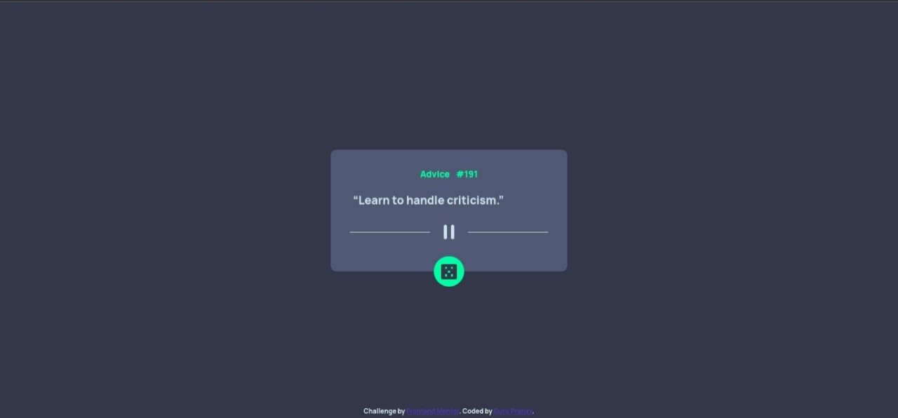

# Frontend Mentor - Advice generator app solution

This is my solution to [Advice generator app challenge on Frontend Mentor](https://www.frontendmentor.io/challenges/advice-generator-app-QdUG-13db)

## Table of contents

- ## [Overview](#overview)
  - [Screenshots](#screenshots)
  - [Links](#links)
- ## [BuiltWith](#built-with)
  - [HTML](#html)
  - [CSS](#css)
  - [JS](#javascript)
- ## [Author](#author)

## Overview

This is app is built with vanilla HTML, CSS and JavaScript. No Frontend frameworks used.

### Screenshots

### Links

- Solution URL: [https://github.com/Gurupranav-tech/advice-generator-app-challenge](https://github.com/Gurupranav-tech/advice-generator-app-challenge)
- Live URL: [https://gurupranav-tech.github.io/advice-generator-app-challenge/](https://gurupranav-tech.github.io/advice-generator-app-challenge/)

## Built With

### HTML

- HTML5
- Semantic HTML5 Markup

### CSS

- Vanilla CSS
- CSS Custom properties
- CSS Flexbox
- CSS Grid System
- CSS Pseudo elements

### JavaScript

- Vanilla JS
- ES6 JS
- Async/Await JS

## Author

- Twitter - [@PRGuruPranav1](https://twitter.com/PRGuruPranav1)
